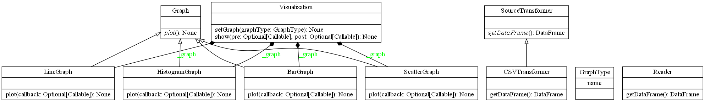

# Assignment for **Análisis Masivo de Datos** subject's part 2; data graph

Marcos Barrios, Eugenio Hernandez

## UML Class diagram

## Packages diagram

## TODO

 - Implement a line bar chart graph class
 - maybe create dataframe validation classes
